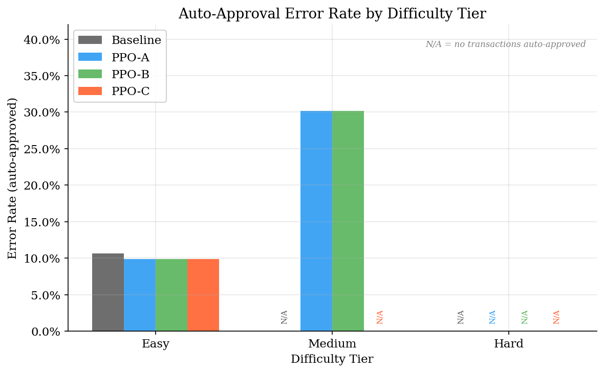

# Learned Routing Under Uncalibrated LLM Confidence: a PPO Case Study on a Production Accounting Pipeline

**Rajarshi Nandi** — `rajarshin264@gmail.com` — [github.com/rajo69/AI-Accountant-with-Reinforcement-Learning-Routing](https://github.com/rajo69/AI-Accountant-with-Reinforcement-Learning-Routing) — April 2026

*This is the 1-page companion note to the repository. For the full methodology, references, and limitations, see the repository README.*

---

## Problem

Production agentic pipelines increasingly rely on fixed confidence thresholds to decide when an LLM-based component may act autonomously versus escalate to a human. These thresholds (e.g. `confidence > 0.85 ⇒ auto-approve`) are hand-tuned and do not adapt to input difficulty, stakes, or operator load. Confidence-gated autonomy is a core unsolved problem for production deployments of agentic AI.

## Question

Can a lightweight PPO policy, observing the same confidence score plus a handful of transaction features, outperform the hand-tuned threshold routing of a production LLM agent on a real-world pipeline?

## Setup

The parent system is an AI bookkeeping assistant for UK accountants. A `CategoriserAgent` (Claude Haiku via Instructor) assigns a category and a confidence score to each Xero bank transaction; a hand-tuned router then picks one of three actions: `AUTO_APPROVE`, `SURFACE_FOR_REVIEW`, or `REJECT_FOR_MANUAL`. We formalise this as a Gymnasium MDP, generate 882 synthetic transactions (stratified 80/20, real Claude confidence scores) from 50 labelled seeds, and train three PPO variants (Stable-Baselines3 2.7.1, 100k steps, seed=42) corresponding to three deployment priorities: a typical firm (A), a workload-weighted high-volume firm (B), and a compliance-critical setting (C) with a 5× penalty on silent auto-approval errors.

## Results (held-out n=177; Wilson 95% CIs; two-proportion z-tests)

| Metric | Baseline | PPO (A/B/C identical) | p |
|---|:---:|:---:|:---:|
| Routing accuracy (all 177) | 66.7% [59.4, 73.2] | 63.3% [56.0, 70.0] | 0.504 |
| Auto-approval precision | 72.6% [63.7, 79.9] | 77.8% [67.6, 85.5] | 0.410 |
| Auto-approval error rate | 27.4% [20.1, 36.3] | 22.2% [14.5, 32.4] | 0.410 |
| **Auto-approval rate** | **63.8% [56.5, 70.6]** | **45.8% [38.6, 53.1]** | **<0.001** |

All three PPO variants produce **identical** action sequences on the eval set. Of the four metrics, only auto-approval *rate* differs significantly. The mechanism is visible in the per-tier breakdown among auto-approved transactions: the baseline auto-approves 31 medium-tier transactions at a **54.8% [37.8, 70.8]** error rate (more wrong than right), while the PPO policies auto-approve **zero** medium-tier.

## Interpretation

The apparent accuracy and precision gains of PPO over the baseline are **not** statistically significant at n=177. The defensible contribution on the natural data regime is not "PPO improves accuracy" but "PPO learns to refuse to auto-approve the tier where the baseline is dangerously wrong."

Two probes refine the mechanistic story. A **calibration probe** (Platt-scaled logistic regression on [confidence, amount, tier_onehot] → is_correct) improves proper scoring rules on eval (Brier 0.295 → 0.215) but does not resolve the A/B/C convergence — all three variants still produce identical action sequences. A **regime probe** reshapes easy-tier accuracy to 0.72, placing it inside the EV-divergence band (0.64, 0.80) where Variant A and B prefer AUTO_APPROVE but Variant C prefers SURFACE_FOR_REVIEW. On the reshaped set the variants diverge exactly as the EV break-even math predicts: A and B auto-approve the entire easy tier while C auto-approves nothing. The binding constraint on variant divergence is therefore the **per-tier accuracy structure**, not calibration quality alone: reward-driven policies differ when the reward tables disagree on the tier-level EV-optimal action at the observed accuracies, and agree otherwise.

## Next work

Multi-sample self-consistency for a fundamentally different uncertainty signal; multi-seed training for reviewer-hygiene robustness; a larger seed-independent eval set to separate statistical power from seed-level dependence; extension to the parent pipeline's reconciliation agent.

## Code, data, reproducibility

Full code, held-out eval set, trained PPO models, and a reproducible statistical-analysis script are at the GitHub link above (MIT). All result numbers on this page regenerate via `python -m agent.evaluate` followed by `python -m experiments.statistical_analysis`.
